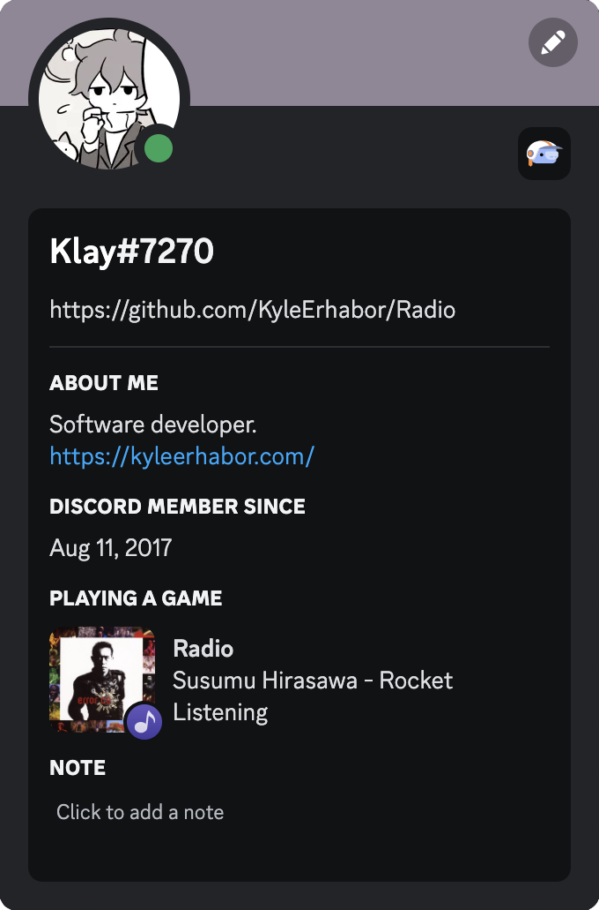

# Radio

Broadcast your currently playing song in [Doppler](https://brushedtype.co/doppler/) to [Discord](https://discord.com/) via Rich Presence.

  
Example

  
  

## Installing

You can either download one of the [releases](https://github.com/KyleErhabor/Radio/releases) or build from source in Xcode.

## Limitations

### Discord Client

Currently, Radio expects that Discord is running throughout its entire execute. This has some unfortunate consequences:
- If you quit Discord while Radio is running, it'll begin using excess resources.
- If you start Radio before Discord has started or initialized, it won't be able to send rich presence.

In both these cases, you should quit Radio and start it after Discord.

### Artwork

Discord uses Activity Asset Images for images displayed in Rich Presence. These must either be URLs to images on the web or IDs for asset images uploaded to the Developer Portal. This is troublesome, as album artwork in Doppler is image data and does not correspond to any URL. To circumvent this limitation, Radio broadcasts an ID associated with the song album, where the album artist and album name are separated by a space and normalized. For example, "Rocket" by Susumu Hirasawa is broadcasted as `susumu_hirasawa_rocket`. With this composition, an image associated with the album can be uploaded to the Developer Portal.
1. Go to the [Developer Portal](https://discord.com/developers/applications)
2. Click the "New Application" button to create a new application for yourself (e.g. call it Radio)
3. On the General Information tab, copy the Application ID and replace the default used in Radio with it
4. Click on the Rich Presence > Art Assets tabs and use the "Add Image(s)" button to upload album artwork. Make sure the names of the image files uploaded match with the ID composition
5. Enable "Display Artwork" in Radio for it to send IDs to Discord. With that, you should start seeing album artwork

If you use [Meta for Mac](https://www.nightbirdsevolve.com/meta/), you can follow this process to export your album artwork to files.
1. Import all your files
2. Export them all with the following pattern: `albumArtist% %album` 

#### Normalization

The normalization Discord applies to names differs from Radio's. If you're finding certain songs to not have their album artwork displayed, please [create an issue](https://github.com/KyleErhabor/Radio/issues/new). 

#### Sizes

Discord requires asset images to be at least 512x512.
